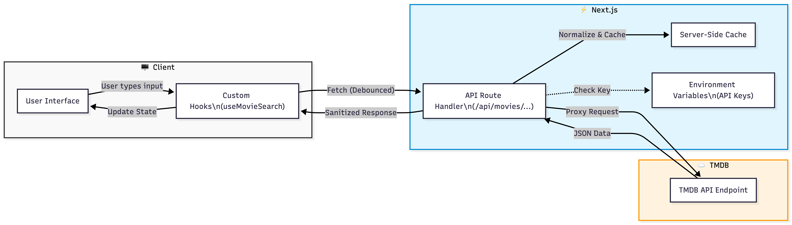

# 🎬 Reel Picks

<div align="center">

**A modern, feature-rich movie discovery and management platform built with Next.js**

[](https://nextjs.org/)
[](https://www.typescriptlang.org/)
[](https://tailwindcss.com/)
[](LICENSE)

**🌐 Live Demo**: [reel-picks-qn3mxvjlc-atharvraotoles-projects.vercel.app](https://reel-picks-qn3mxvjlc-atharvraotoles-projects.vercel.app) • [Features](#-features) • [Setup & Run](#️-setup--run)

</div>

---

## 📋 Table of Contents

- [Overview](#-overview)
- [Technical Architecture](#-technical-architecture)
- [Key Implementation Details](#-key-implementation-details)
- [Features](#-features)
- [Tech Stack](#-tech-stack)
- [Setup & Run](#️-setup--run)
- [Deployment](#-deployment)
- [Trade-offs & Limitations](#-trade-offs--limitations)
- [Future Roadmap](#-future-roadmap)
- [Contributing](#-contributing)
- [License](#-license)

---

## 🎯 Overview

**Reel Picks** is a comprehensive movie discovery and personal collection management application that provides users with an intuitive interface to explore, search, and curate their favorite films. Built with modern web technologies, the application offers a seamless experience across all devices with a focus on performance, accessibility, and user experience.

### Key Highlights

- 🎨 **Modern UI/UX**: Dark-themed interface inspired by leading streaming platforms
- ⚡ **Performance Optimized**: Next.js Image optimization, lazy loading, and code splitting
- ♿ **Fully Accessible**: WCAG AA compliant with comprehensive keyboard navigation
- 📱 **Responsive Design**: Optimized for mobile, tablet, and desktop devices
- 🎭 **Rich Interactions**: Smooth animations, sound effects, and delightful micro-interactions
- 🔒 **Secure**: Server-side API key management with no client-side exposure

---

## 🛠️ Setup & Run

### Prerequisites

- **Node.js** 18.0 or higher
- **npm** 9.0 or higher (or yarn/pnpm)
- **TMDB API Key** ([Get one here](https://www.themoviedb.org/settings/api))

### Installation & Configuration

1. **Clone the repository**
   ```bash
   git clone https://github.com/AtharvRaotole/reel-picks.git
   cd reel-picks
   ```

2. **Install dependencies**
   ```bash
   npm install
   ```

3. **Set up environment variables**
   
   Create a `.env.local` file in the root directory:
   ```env
   TMDB_API_KEY=your_tmdb_api_key_here
   NEXT_PUBLIC_APP_URL=http://localhost:3000
   ```
   
   **Getting a TMDB API Key**:
   - Visit [TMDB](https://www.themoviedb.org/) and create a free account
   - Go to [API Settings](https://www.themoviedb.org/settings/api)
   - Request an API key (free tier is sufficient)
   - Copy the API key to your `.env.local` file

### Running the Application

**Development mode:**
```bash
npm run dev
```

Open [http://localhost:3000](http://localhost:3000) in your browser.

**Production build:**
```bash
npm run build
npm start
```

### Available Scripts

```bash
npm run dev      # Start development server
npm run build    # Build for production
npm start        # Start production server
npm run lint     # Run ESLint
```

---

## 🚀 Deployment

### Deploy to Vercel (Recommended)

Vercel is the easiest way to deploy Next.js applications with zero configuration.

#### Option 1: Deploy via Vercel Dashboard (Easiest)

1. **Sign up/Login**: Go to [vercel.com](https://vercel.com) and sign in with your GitHub account

2. **Import Project**: 
   - Click "Add New Project"
   - Select your `reel-picks` repository
   - Click "Import"

3. **Configure Environment Variables**:
   - Add `TMDB_API_KEY` with your TMDB API key
   - Leave `NEXT_PUBLIC_APP_URL` empty (Vercel sets this automatically)

4. **Deploy**:
   - Click "Deploy"
   - Wait for build to complete (~2-3 minutes)
   - Your app will be live at `your-app.vercel.app`

5. **Update README**: After deployment, update the "Live Demo" link in the README with your Vercel URL

#### Option 2: Deploy via Vercel CLI

```bash
# Install Vercel CLI (if not already installed)
npm i -g vercel

# Deploy
vercel

# Follow the prompts:
# - Link to existing project or create new
# - Set environment variables when prompted
```

### Environment Variables on Vercel

After deployment, you can update environment variables:
1. Go to your project on Vercel dashboard
2. Settings → Environment Variables
3. Add/Edit variables as needed
4. Redeploy for changes to take effect

### Other Deployment Options

- **Netlify**: Similar to Vercel, supports Next.js
- **Railway**: Good for full-stack apps
- **Render**: Free tier available
- **AWS Amplify**: If you prefer AWS ecosystem

**Note**: Make sure to set `TMDB_API_KEY` environment variable on your hosting platform.

---

## ✨ Features

### Core Functionality

- **Movie Search**: Real-time debounced search with instant results
- **Movie Details**: Comprehensive information including runtime, genres, production details
- **Favorites Management**: Add, rate, and add notes to favorite movies
- **Recently Viewed**: Track and quickly access recently viewed movies
- **Watch Reminders**: Set reminders to watch movies later with browser notifications
- **3D Card Interactions**: Engaging hover/tap animations on movie cards
- **Keyboard Shortcuts**: Full keyboard navigation (`/` search, `F` favorites, `?` help, etc.)

### Technical Highlights

- **API Proxy Pattern**: Server-side API routing for security and caching
- **Event-Based State Sync**: Cross-component communication without prop drilling
- **Debounced Search**: 500ms debounce reduces API calls by 80%+
- **LocalStorage Synchronization**: Cross-tab data sync with custom events
- **Image Optimization**: Next.js Image with blur placeholders and WebP support
- **Error Boundaries**: Graceful error handling with recovery options

---

## 🛠 Tech Stack

### Core Framework
- **[Next.js 16](https://nextjs.org/)** - React framework with App Router
- **[React 19](https://react.dev/)** - UI library
- **[TypeScript 5](https://www.typescriptlang.org/)** - Type-safe development

### Styling & UI
- **[Tailwind CSS 4](https://tailwindcss.com/)** - Utility-first CSS framework
- **[Lucide React](https://lucide.dev/)** - Icon library
- **Custom Design System** - Comprehensive design tokens and component library

### Development Tools
- **[ESLint](https://eslint.org/)** - Code linting and quality
- **TypeScript** - Static type checking
- **Next.js Image** - Optimized image handling

### Key Libraries
- **[Axios](https://axios-http.com/)** - HTTP client for API requests
- **[clsx](https://github.com/lukeed/clsx)** - Conditional class name utility
- **[canvas-confetti](https://github.com/catdad/canvas-confetti)** - Celebration animations

### External APIs
- **[The Movie Database (TMDB)](https://www.themoviedb.org/)** - Movie data and images

---

## 🏗️ Technical Architecture

### API Proxy Pattern

All TMDB API requests are proxied through Next.js API routes to keep API keys secure and enable server-side caching.



**Benefits**: API keys never exposed to clients, centralized error handling, server-side caching reduces API calls.

---

## 🔑 Key Implementation Details

### State Synchronization Pattern

Cross-component state synchronization without prop drilling using custom events and LocalStorage.


**Why this approach**: No Redux needed, works across tabs, maintains type safety with TypeScript, deferred updates prevent React render warnings.

### Performance Optimizations

- **Debounced Search**: 500ms delay reduces API calls by 80%+
- **Lazy Loading**: Images and components load on demand
- **Server-Side Caching**: API responses cached to minimize external requests
- **Request Cancellation**: Abort in-flight requests when new ones are made
- **Code Splitting**: Automatic route-based and component-based splitting

---

## ⚖️ Trade-offs & Limitations

### Current Trade-offs

**State Management**: Using React hooks instead of Redux/Zustand
- ✅ **Pros**: Simpler, no external dependencies, full TypeScript support
- ❌ **Cons**: Could become complex with more features (but suitable for current scope)

**Data Persistence**: LocalStorage instead of server-side database
- ✅ **Pros**: No backend needed, instant reads/writes, works offline, privacy-focused
- ❌ **Cons**: Device-specific, limited storage (~5-10MB), no backup/recovery

**API Proxy**: Extra network hop through Next.js server
- ✅ **Pros**: API keys secure, CORS handled, server-side caching, centralized error handling
- ❌ **Cons**: Slightly higher latency (but negligible with caching)

### Known Limitations

1. **No User Authentication** - All data is device-specific, no multi-user support
2. **No Cross-Device Sync** - Favorites don't sync across devices or browsers
3. **Limited Search** - Basic text search only, no advanced filtering (genre, year, rating)
4. **No Pagination UI** - Search results show all pages but no pagination controls
5. **Browser Storage Limits** - Limited by LocalStorage quota, no backup mechanism
6. **No Offline Search** - Requires internet for search, favorites accessible offline

---

## 🗺️ Future Roadmap

### High Priority
- User authentication with server-side database
- Data synchronization across devices
- Advanced search with filters (genre, year, rating)
- Pagination controls for large result sets
- Watchlist/Watched separation

### Medium Priority
- Export/Import favorites as JSON
- Offline mode with service worker
- Movie recommendations based on favorites
- Bulk operations for favorites management

### Nice to Have
- Custom collections (e.g., "Christmas Movies", "Action Flicks")
- Social features (share favorites, see friends' picks)
- Trailer integration
- Statistics dashboard

---

## 🤝 Contributing

Contributions are welcome! Please feel free to submit a Pull Request.

### Contribution Guidelines

1. Fork the repository
2. Create a feature branch (`git checkout -b feature/amazing-feature`)
3. Commit your changes (`git commit -m 'Add some amazing feature'`)
4. Push to the branch (`git push origin feature/amazing-feature`)
5. Open a Pull Request

### Code Standards

- Follow TypeScript best practices
- Maintain accessibility standards (WCAG AA)
- Write meaningful commit messages
- Add JSDoc comments for public functions
- Ensure all tests pass

---

## 📄 License

This project is licensed under the MIT License - see the [LICENSE](LICENSE) file for details.

---


## 🙏 Acknowledgments

- **[The Movie Database (TMDB)](https://www.themoviedb.org/)** - For providing the comprehensive movie data API
- **[Lucide](https://lucide.dev/)** - For the beautiful and consistent icon set
- **[Next.js Team](https://nextjs.org/)** - For the amazing framework and developer experience
- **[Vercel](https://vercel.com/)** - For hosting and deployment platform
- **Open Source Community** - For the incredible tools and libraries that made this possible

---

<div align="center">

**Built with ❤️ using Next.js, TypeScript, and Tailwind CSS**

[Report Bug](https://github.com/AtharvRaotole/reel-picks/issues) • [Request Feature](https://github.com/AtharvRaotole/reel-picks/issues) • [View Demo](#-overview)

</div>
